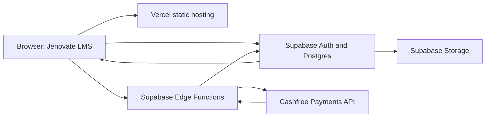
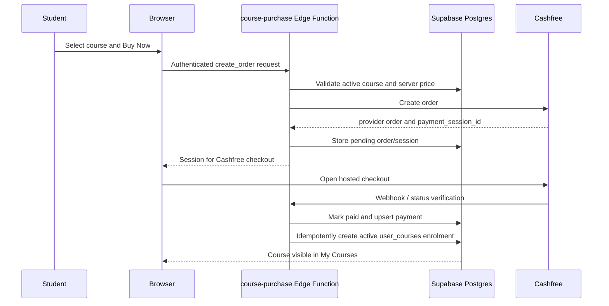

# Jenovate LMS Production Verification Report

**Assessment date:** 21 September 2026  
**Production URL tested:** https://lms-website-zeta-vert.vercel.app/  
**Scope:** hosted Cashfree checkout entry, payment-to-enrollment implementation, authorization, deployment exposure, and regression checks. No payment credentials were entered and no payment was completed during this assessment.

## Executive Summary

The deployed Vercel application successfully created a Cashfree production order, generated a payment session, and opened the hosted Cashfree checkout UI for **each of the 29 active courses**. Each approved QA order was cancelled afterwards; no enrolments were created by this checkout-entry exercise.

A separately observed real IoT payment had already completed the full verified server-side path: Cashfree success, payment record update, and one active enrolment for the exact payer and course. The system is therefore **conditionally production ready for checkout entry and verified payment enrolment**.

The remaining production gate is operational rather than a known checkout defect: an active deployed Supabase Edge Function named `api` has no corresponding source in this repository, so it cannot receive a complete source audit. Public Google Drive lesson URLs can also be shared outside the LMS after someone obtains them; LMS access checks do not revoke public Drive sharing.

## Product Overview

Jenovate is a role-based learning-management system for course discovery, payment, enrolment, learning content, quizzes, batches, chat, tasks, discussions, announcements, referrals, coins, and support workflows.

| Role | Primary capabilities |
| --- | --- |
| Student | Browse courses, purchase, access assigned learning, submit work, chat in assigned batches, raise questions, use rewards and support features. |
| Mentor | Manage assigned learning groups, respond to learners, review work, and support course delivery. |
| Admin | Manage courses, users, assignments, batches, content, payments, and operational controls. |

## Architecture

### Core Implementation

- Static HTML, CSS, and browser JavaScript frontend.
- Supabase Auth, Postgres, Row Level Security, Storage, and Edge Functions.
- Cashfree Payments, using a server-created production payment session.
- Vercel deployment for the currently tested public site.
- GitHub repository commit assessed: `5f1cca4e`.

## Payment and Enrolment Workflow

### Payment Data Path

| Concern | Current implementation |
| --- | --- |
| Order records | `public.lms_course_orders` |
| Payment records | `public.lms_course_payments` |
| Enrolment records | `public.user_courses` |
| Purchase handler | `supabase/functions/course-purchase/index.ts` |
| Provider | Cashfree production API: `https://api.cashfree.com/pg` |
| Price authority | Server reads the course amount; browser-supplied price is not trusted. |
| Verification | Server checks provider status and processes webhook/return handling. |
| Duplicate protection | Payment upsert and enrolment existence checks make payment delivery retry-safe. |

## Hosted Checkout Verification: 29/29

**Method:** A dedicated QA student used the deployed Vercel course-detail page for every active course. For each course, the UI Buy Now action created the server-side order, received a Cashfree payment session, and opened the hosted checkout. No payment information was entered. The 29 resulting QA orders were confirmed `cancelled` in Supabase afterward.

| Course | Price (INR) | Order | Session | Checkout UI | Result |
| --- | ---: | --- | --- | --- | --- |
| AI (Agentic & Generative) | 5,999 | Yes | Yes | Opened | PASS |
| Artificial Intelligence | 5,999 | Yes | Yes | Opened | PASS |
| Artificial Intelligence and Machine Learning | 5,999 | Yes | Yes | Opened | PASS |
| AutoCAD | 5,999 | Yes | Yes | Opened | PASS |
| Business Analysis | 5,999 | Yes | Yes | Opened | PASS |
| Cloud Computing | 5,999 | Yes | Yes | Opened | PASS |
| Cyber Security & Ethical Hacking | 5,999 | Yes | Yes | Opened | PASS |
| Data Analysis | 5,999 | Yes | Yes | Opened | PASS |
| DevOps | 5,999 | Yes | Yes | Opened | PASS |
| Digital Marketing | 5,999 | Yes | Yes | Opened | PASS |
| DSA with Python | 5,999 | Yes | Yes | Opened | PASS |
| Embedded Systems | 5,999 | Yes | Yes | Opened | PASS |
| Finance | 5,999 | Yes | Yes | Opened | PASS |
| Front-End Web Development | 5,999 | Yes | Yes | Opened | PASS |
| Full-Stack Web Development | 5,999 | Yes | Yes | Opened | PASS |
| Human Resource Management | 5,999 | Yes | Yes | Opened | PASS |
| Hybrid Electric Vehicle | 5,999 | Yes | Yes | Opened | PASS |
| Internet of Things (IoT) | 1 | Yes | Yes | Opened | PASS |
| IoT & Robotics | 5,999 | Yes | Yes | Opened | PASS |
| Machine Learning | 5,999 | Yes | Yes | Opened | PASS |
| Medical Coding | 5,999 | Yes | Yes | Opened | PASS |
| Programming in Java | 5,999 | Yes | Yes | Opened | PASS |
| Programming in Python | 5,999 | Yes | Yes | Opened | PASS |
| Psychology | 5,999 | Yes | Yes | Opened | PASS |
| Software Engineering | 5,999 | Yes | Yes | Opened | PASS |
| Startup & Entrepreneurship | 5,999 | Yes | Yes | Opened | PASS |
| Stock Marketing | 5,999 | Yes | Yes | Opened | PASS |
| UI/UX | 5,999 | Yes | Yes | Opened | PASS |
| VLSI | 5,999 | Yes | Yes | Opened | PASS |

**Important:** Checkout UI opening confirms the hosted payment entry path, not payment completion. The assessment intentionally stopped before any transaction.

## Verified Payment-to-Enrolment Evidence

A previously completed IoT payment supplied full-path evidence:

| Test | Result | Evidence |
| --- | --- | --- |
| Cashfree order created | PASS | Provider order `jnv_277421af22e64ee29884fae937bc6438` |
| Payment successful | PASS | Server-side status processing completed |
| Backend verification | PASS | `course-purchase` verified provider status |
| Order marked paid | PASS | Order `a7088b56-d7df-4997-944d-a9c8d0e6b87d` updated successfully |
| Enrolment created | PASS | Active `user_courses` row `7f651fca-0067-474f-a5fa-ce824802b2b3` |
| Correct user/course | PASS | User `8d1e6b8a-fc80-47ef-935f-2716f245cb1e`, IoT course `2207afb1-a37f-446b-92e2-f95752fdc3e9` |
| Course visible after fresh login | PASS | My Learning and learning player opened for the enrolled course |
| Duplicate enrolment prevention | PASS | Existing-enrolment checks and idempotent writes are implemented |
| Dynamic unpaid-user direct-access test | NOT VERIFIED | Static/RLS review supports denial; a fresh adversarial browser test remains recommended |

## Security Verification

| Area | Result | Evidence / notes |
| --- | --- | --- |
| HTTPS transport | PASS | Vercel serves HTTPS and HSTS. |
| Payment secrets | PASS | Cashfree credentials are Edge Function environment values, not frontend values. |
| Client price tampering | PASS | Server derives amount from the database course. |
| Client course tampering | PASS | Missing/unknown course calls return 400/404; authenticated server validates the course. |
| Authentication required for purchase | PASS | Unauthenticated purchase call returned 401. |
| Payment verification | PASS | Server performs provider verification before granting access. |
| Enrolment after failed/cancelled payment | PASS | 29 approved QA orders were all cancelled; no payment was made. |
| CORS for sensitive Edge Functions | PASS | Allowlist includes Jenovate production and Vercel deployment, not arbitrary browser origins. |
| Security headers | PASS | CSP, `X-Content-Type-Options`, `X-Frame-Options`, Referrer-Policy, and Permissions-Policy deployed. |
| Storage lesson isolation | PASS | Storage policy requires active course enrolment for restricted study materials. |
| Build/test health | PASS | 46 automated tests passed; build, type-check, and dependency audit passed. |
| Backup/debug/source exposure on Vercel | PASS | Tested backup, `.env`, debug, and script paths returned 404. |
| Unreviewed deployed Edge Function | OPEN | Active `api` function has no repository source; cannot receive a complete code audit. |
| Public Drive links | LIMITATION | Public Google Drive media can be shared independently once a URL is known. |

## Deployment Improvements Included

- Vercel headers in `vercel.json` for CSP and baseline browser hardening.
- Vercel exclusion for legacy `backup` content.
- Supabase Storage policy migration restricting study material access to active enrolments.
- Origin allowlist for sensitive Supabase functions.
- Updated `sharp` dependency and verified no known npm audit findings.

## Final Decision

**Status: CONDITIONALLY PRODUCTION READY.**

Checkout creation and Cashfree checkout entry are verified for all 29 active courses. A real payment-to-enrolment path is verified for IoT. Before issuing an unconditional security sign-off, the deployment owner should either bring the active `api` Edge Function into source control for review or remove it after confirming it is unused. Public Drive course assets should also be moved to restricted delivery if preventing direct sharing is a requirement.

## Recommended Operations Checklist

1. Confirm Cashfree production webhook URL and signing secret in the Cashfree dashboard.
2. Review or retire the untracked `api` Edge Function.
3. Rotate any historic credentials that may have appeared in prior Hostinger-hosted artifacts.
4. Perform one controlled real production payment and reconcile the Cashfree dashboard, `lms_course_orders`, `lms_course_payments`, and `user_courses`.
5. Replace public Google Drive files with private storage or signed URLs if course-media sharing must be prevented.
